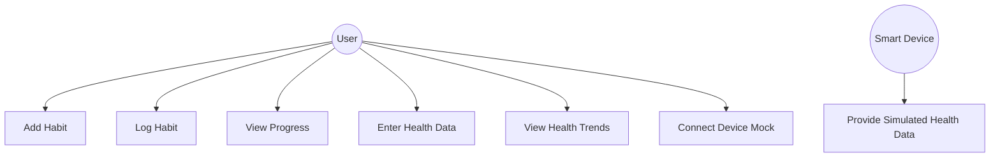
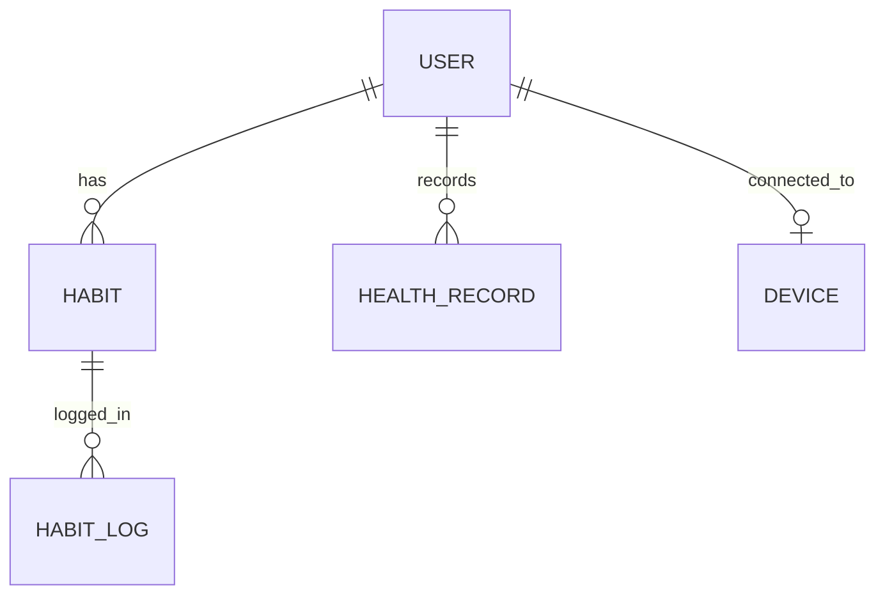
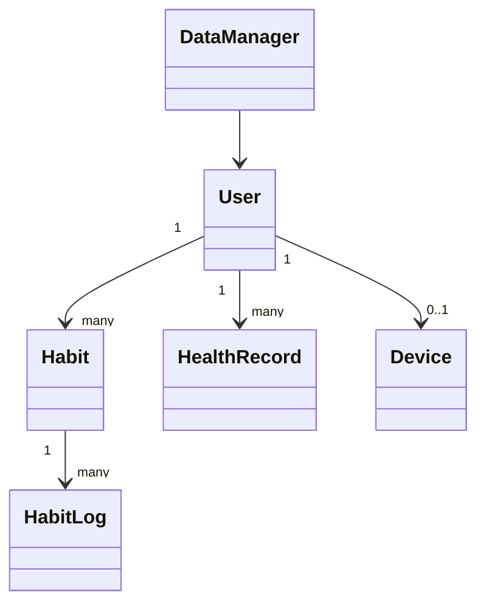

# Diagrams

## Use Case Diagram

```mermaid
flowchart TD
    User((User)) --> UC1[Add Habit]
    User --> UC2[Log Habit]
    User --> UC3[View Progress]
    User --> UC4[Enter Health Data]
    User --> UC5[View Health Trends]
    User --> UC6[Connect Device Mock]
    SmartDevice((Smart Device)) --> UC7[Provide Simulated Health Data]
```

## ER Diagram

```mermaid
erDiagram
    USER ||--o{ HABIT : has
    HABIT ||--o{ HABIT_LOG : logged_in
    USER ||--o{ HEALTH_RECORD : records
    USER ||--o| DEVICE : connected_to
```

## Class Diagram

```mermaid
classDiagram
    User "1" --> "many" Habit
    Habit "1" --> "many" HabitLog
    User "1" --> "many" HealthRecord
    User "1" --> "0..1" Device
    DataManager --> User
```
